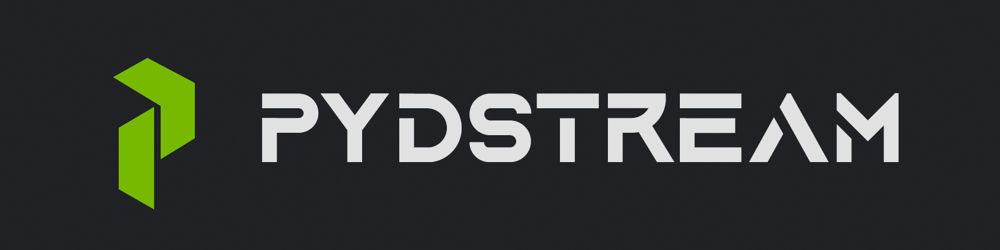
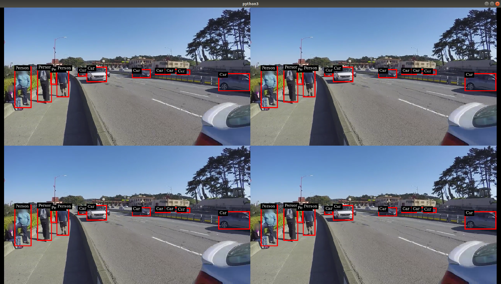
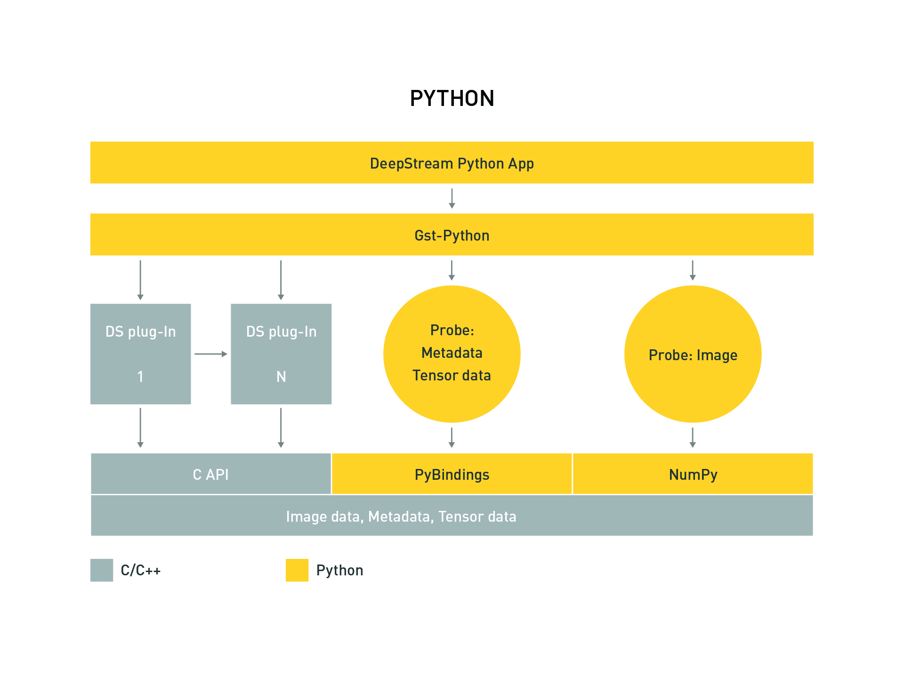

[![Contributors][contributors-shield]][contributors-url]
[![Forks][forks-shield]][forks-url]
[![Stargazers][stars-shield]][stars-url]
[![Issues][issues-shield]][issues-url]
[![LinkedIn][linkedin-shield]][linkedin-url]


<br />

<p align="center">
  <a href="https://github.com/imneonizer/pydstream">
    
  </a>


  <h3 align="center">Deepstream Python API</h3>

  <p align="center">
    Build Deepstream apps easily!
    <br />
    <a href="https://github.com/imneonizer/pydstream"><strong>Explore the docs »</strong></a>
    <br />
    <br />
    <a href="https://github.com/imneonizer/pydstream/tree/main/samples">Samples</a>
    ·
    <a href="https://github.com/imneonizer/pydstream/issues">Report Bug</a>
    ·
    <a href="https://github.com/imneonizer/pydstream/issues">Request Feature</a>
  </p>

</p>

<details open="open">
  <summary>Table of Contents</summary>
  <ol>
    <li>
      <a href="#about-the-project">About The Project</a>
    </li>
    <li>
      <a href="#getting-started">Getting Started</a>
      <ul>
        <li><a href="#prerequisites">Prerequisites</a></li>
        <li><a href="#installation">Installation</a></li>
      </ul>
    </li>
    <li><a href="#usage">Usage</a></li>
    <li><a href="#roadmap">Roadmap</a></li>
    <li><a href="#contributing">Contributing</a></li>
    <li><a href="#license">License</a></li>
    <li><a href="#contact">Contact</a></li>
    <li><a href="#acknowledgements">Acknowledgements</a></li>
  </ol>
</details>

<!-- ABOUT THE PROJECT -->

## About The Project



This repository contains Python bindings and sample applications for the [DeepStream SDK](https://developer.nvidia.com/deepstream-sdk).

DeepStream pipelines can be constructed using Gst Python, the GStreamer framework's Python bindings. For accessing DeepStream MetaData, Python bindings are provided in the form of a compiled module which is included in the DeepStream SDK.



These bindings support a Python interface to the MetaData structures and functions. Usage of this interface is documented in the [HOW-TO Guide](https://github.com/imneonizer/pydstream/blob/main/HOWTO.md) and demonstrated in the sample applications.
This release adds bindings for decoded image buffers (NvBufSurface) as well as inference output tensors (NvDsInferTensorMeta).


<!-- GETTING STARTED -->

## Getting Started

Sample applications provided here demonstrate how to work with DeepStream pipelines using Python.
The sample applications require [MetaData Bindings](https://github.com/NVIDIA-AI-IOT/deepstream_python_apps#metadata_bindings) to work.

To run the sample applications or write your own, please consult the [HOW-TO Guide](https://github.com/NVIDIA-AI-IOT/deepstream_python_apps/blob/master/HOWTO.md)

### Prerequisites

- Ubuntu 18.04
- [DeepStream SDK 5.1](https://developer.nvidia.com/deepstream-download) or later
- Python 3.6
- [Gst Python](https://gstreamer.freedesktop.org/modules/gst-python.html) v1.14.5

### Installation

1. Clone the repo

   ````shell
   git clone https://github.com/imneonizer/pydstream.git
   cd pydstream
   ````

2. Build the container

   ````shell
   sudo chmod +x container.sh
   sudo ./container.sh --build
   ````

3. Run the container

   ````shell
   sudo ./container.sh --run
   ````


<!-- USAGE EXAMPLES -->

## Usage

Go to the samples directory and run test apps, for example:

````shell
cd samples/deepstream-test1
python ./deepstream_test_1.py
````

You can explore the sample apps to understand how pipeline construction works.


<!-- ROADMAP -->

## Roadmap

See the [open issues](https://github.com/othneildrew/Best-README-Template/issues) for a list of proposed features (and known issues).


<!-- CONTRIBUTING -->
## Contributing

Contributions are what make the open source community such an amazing place to be learn, inspire, and create. Any contributions you make are **greatly appreciated**.

1. Fork the Project
2. Create your Feature Branch (`git checkout -b feature/AmazingFeature`)
3. Commit your Changes (`git commit -m 'Add some AmazingFeature'`)
4. Push to the Branch (`git push origin feature/AmazingFeature`)
5. Open a Pull Request


<!-- LICENSE -->
## License

DeepStream Python Apps use third-party packages that may be distributed under
different licensing terms from DeepStream licenses. See [LICENSE](LICENSE.txt) for more information.

<!-- CONTACT -->

## Contact

Nitin Rai - [@imneonizer](https://twitter.com/imneonizer) - mneonizer@gmail.com

Project Link: https://github.com/imneonizer/pydstream


<!-- ACKNOWLEDGEMENTS -->

## Acknowledgements
* https://github.com/NVIDIA-AI-IOT/deepstream_python_apps
* https://docs.nvidia.com/metropolis/deepstream/python-api


<!-- MARKDOWN LINKS & IMAGES -->
<!-- https://www.markdownguide.org/basic-syntax/#reference-style-links -->

[contributors-shield]: https://img.shields.io/github/contributors/imneonizer/pydstream.svg?style=for-the-badge
[contributors-url]: https://github.com/imneonizer/pydstream/graphs/contributors
[forks-shield]: https://img.shields.io/github/forks/imneonizer/pydstream.svg?style=for-the-badge
[forks-url]: https://github.com/imneonizer/pydstream/network/members
[stars-shield]: https://img.shields.io/github/stars/imneonizer/pydstream.svg?style=for-the-badge
[stars-url]: https://github.com/imneonizer/pydstream/stargazers
[issues-shield]: https://img.shields.io/github/issues/imneonizer/pydstream.svg?style=for-the-badge
[issues-url]: https://github.com/imneonizer/pydstream/issues
[license-shield]: https://img.shields.io/github/license/imneonizer/pydstream.svg?style=for-the-badge
[license-url]: https://github.com/imneonizer/pydstream/blob/master/LICENSE.txt
[linkedin-shield]: https://img.shields.io/badge/-LinkedIn-black.svg?style=for-the-badge&logo=linkedin&colorB=555
[linkedin-url]: https://www.linkedin.com/in/imneonizer/