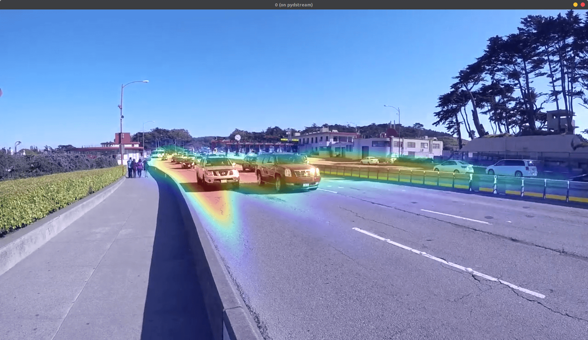

# Heatmap App

This is a sample application utilizing `pydstream` to add probes in the gstreamer pipeline and generating heatmaps for moving vehicles.

To run the application make sure you are using the provided Docker environement.

1. Clone the pydstream repository

   ````sh
   git clone https://github.com/imneonizer/pydstream.git
   cd pydstream
   ````

2. Build the container

   ````sh
   sudo chmod +x ./container.sh
   sudo ./container.sh --build
   ````

3. Run the container

   ````sh
   sudo ./container.sh --run
   ````

4. Navigate to application directory inside the application, install dependencies and run

   ````sh
   cd samples/heatmap-app
   pip install -r requirements.txt
   python app.py
   ````

Because of `X-server` issue in gstreamer probe and deepstream doesnt allows to push frames to OSD, I have used a workaround that pushes the frames to another process via `zmq` that uses opencv to show the frames. The idea can be ported to stream the heatmap to external client.

